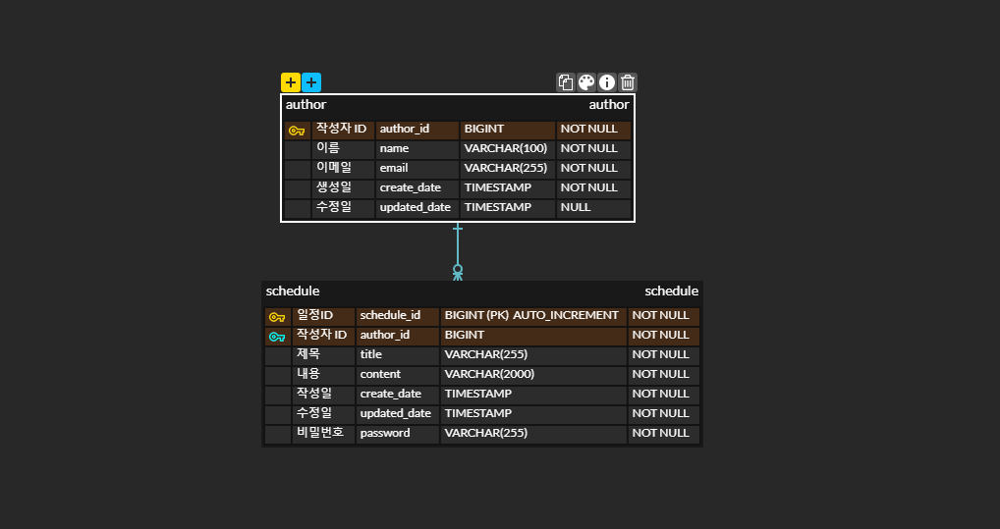

# scheduler

## ERD설계

## 일정 관리 API 명세서

| 기능 | Method | URL | Request (JSON) | Response (JSON) | 상태 코드 |
|------|--------|-----|---------------|-----------------|-----------|
| **일정 생성** | `POST` | `/schedules` | ```json { "title": "회의", "content": "팀 미팅", "date": "2025-03-20", "password": "1234" } ``` | ```json { "id": 1, "title": "회의", "content": "팀 미팅", "date": "2025-03-20", "create_date": "2025-03-19T12:00:00", "update_date": "2025-03-19T12:00:00" } ``` | `201 Created` |
| **일정 조회 (전체)** | `GET` | `/schedules` | - | ```json [ { "id": 1, "title": "회의", "content": "팀 미팅", "date": "2025-03-20", "create_date": "2025-03-19T12:00:00", "update_date": "2025-03-19T12:00:00" } ] ``` | `200 OK` |
| **일정 조회 (날짜별)** | `GET` | `/schedules?date=2025-03-20` | - | ```json [ { "id": 1, "title": "회의", "content": "팀 미팅", "date": "2025-03-20", "create_date": "2025-03-19T12:00:00", "update_date": "2025-03-19T12:00:00" } ] ``` | `200 OK` |
| **일정 조회 (키워드 검색)** | `GET` | `/schedules?keyword=회의` | - | ```json [ { "id": 1, "title": "회의", "content": "팀 미팅", "date": "2025-03-20", "create_date": "2025-03-19T12:00:00", "update_date": "2025-03-19T12:00:00" } ] ``` | `200 OK` |
| **일정 수정** | `PUT` | `/schedules/{id}` | ```json { "title": "변경된 제목", "content": "변경된 내용", "password": "1234" } ``` | ```json { "message": "일정이 성공적으로 수정되었습니다." } ``` | `200 OK` / `400 Bad Request` (비밀번호 불일치) |
| **일정 삭제** | `DELETE` | `/schedules/{id}` | ```json { "password": "1234" } ``` | ```json { "message": "일정이 삭제되었습니다." } ``` | `200 OK` / `400 Bad Request` (비밀번호 불일치) |

---

## 사용 기술
- **Spring Boot 3.4.3**
- **Java 21**
- **MySQL**
---

